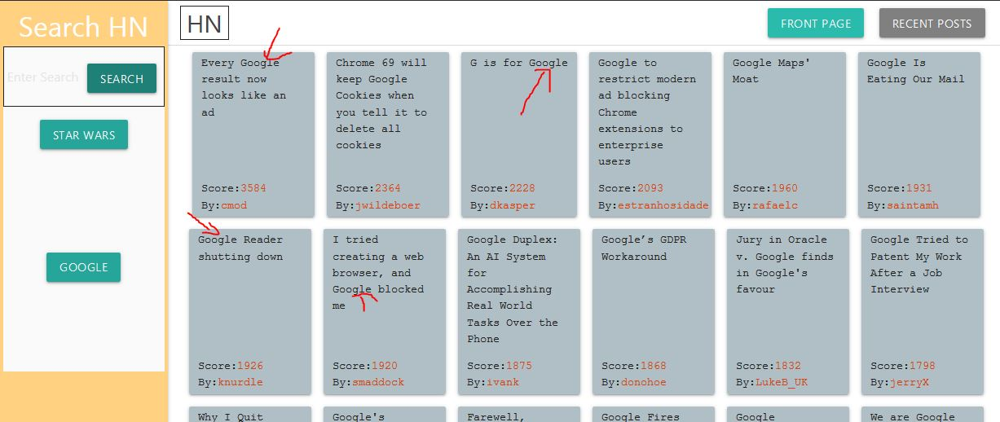

# [Hackernews Actdux](https://dcoco1890.github.io/hackernews-actdux/) is my attempt at a React/Redux Application

If you'd like to see a live demo, [click here!](https://dcoco1890.github.io/hackernews-actdux/)

Since this not a Full-Stack App (no back-end right now) it is hosted on Github pages. Considering adding Redux Persist but not yet implemented  

### How to
* Navigate

When you first open the site you'll be greeted with a page that looks similar to this. Congrats, you are currently viewing the top stories on HackerNews! If you'd like to switch to most recent stories, you can click the recent posts button (red arrow)

If you'd like to switch back, just press the front page button

* Search

If you'd like instead to search HN for stories, you can enter a search query and press the search button or press the enter key, whatever you prefer

You'll know your query was searched for because the articles will change over to your right. Keep in mind, not all searches will return queries. You'll have to actually enter a word and the word will have to appear somewhere in the story. If not, the app will crash and your computer will die (just kidding, you just won't see any results) 

Finally, if you decide you liked a search *so* much you wanna run it **again**, you can just click the button that contains the search you'd like to re-run and you'll see those same articles reappear

### How I created this

This was my first ever REACT/REDUX application, and I gotta say after using it for a while I started to recognize the potential there is as far as state management. Once I figured out how I wanted my state to look and how I wanted my componenets to use that state it was much easier to write the components.

### Links I used to help with this project

[Create React App](https://github.com/facebook/create-react-app).

How to host a [React App on Github Pages](https://github.com/gitname/react-gh-pages)

Materialize for [CSS and Layout](https://materializecss.com/)

This Redux tutorial by [Valentino Gagliardi](https://www.valentinog.com/blog/redux/)

FreeCodeCamp's [Redux Tutorial](https://www.freecodecamp.org/learn/front-end-libraries/redux/)

This egghead.io [Redux Intro](https://egghead.io/courses/getting-started-with-redux)

And of course [HN search API](https://hn.algolia.com/api)

